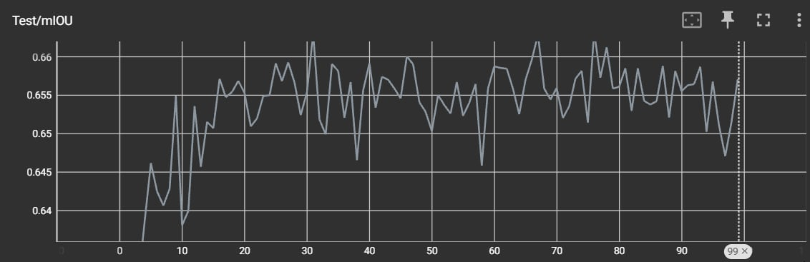

# Semantic Segmentation with DeepLabV3 

This project implements **semantic segmentation using DeepLabV3-ResNet50** trained on the **Pascal VOC 2012 dataset** with PyTorch.

It includes:

- Full **training pipeline**
- **TensorBoard logging** (loss, accuracy, mIoU)
- **Best-model checkpoint saving**
- **Inference & visualization script**
- Example **mIoU training curve**

---

## Project Structure

```
Semantic_Segmentation_DeepLab/
│
├── main.py        # Training pipeline (DeepLabV3 + VOC2012)
├── test.py        # Inference & visualization script
├── data.jpg       # TensorBoard mIoU curve example
├── best_model.pth # Saved best checkpoint (after training)
└── README.md
```

---

## Training Overview

The training script:

- Loads **Pascal VOC 2012** using `torchvision.datasets.VOCSegmentation`
- Uses **DeepLabV3-ResNet50 pretrained backbone**
- Optimizer: **SGD with momentum**
- Loss: **CrossEntropyLoss**
- Metrics:
  - **Pixel Accuracy**
  - **Mean Intersection-over-Union (mIoU)**

The **best model is saved automatically** when validation mIoU improves.  

---

## TensorBoard Result Example

Below is an example **validation mIoU curve** during training:

<p align="center">
  
</p>

This curve shows stable convergence around **~0.65 mIoU** on VOC validation.

---

## Installation

Clone the repository:

```bash
git clone https://github.com/doramonmon2306/Semantic_Segmentation_DeepLab.git
cd Semantic_Segmentation_DeepLab
```

Install dependencies:

```bash
pip install torch torchvision torchmetrics opencv-python numpy matplotlib pillow tqdm tensorboard
```

---

## Dataset Setup

Download **Pascal VOC 2012** and place it in:

```
VOC/
```

Then update the dataset path inside `main.py` if needed.  

---

## Training

Run:

```bash
python main.py
```

During training:

- Loss is logged every iteration
- Accuracy & mIoU are logged every epoch
- Best checkpoint saved as:

```
best_model.pth
```

To view TensorBoard:

```bash
tensorboard --logdir tensorboard
```

---

## Inference & Visualization

Run:

```bash
python test.py
```

The script:

1. Loads **best_model.pth**
2. Runs segmentation on a test image
3. Displays:
   - Original image
   - Predicted segmentation mask
4. Prints detected class names in the image

---

## Author


GitHub: https://github.com/doramonmon2306

---

# Segmentation Sémantique avec DeepLabV3 (Version Française)

Ce projet implémente la **segmentation sémantique avec DeepLabV3-ResNet50** entraîné sur le **jeu de données Pascal VOC 2012** avec PyTorch.

Il comprend :

- Pipeline d'**entraînement complet**
- **Journalisation TensorBoard** (perte, précision, mIoU)
- **Sauvegarde du meilleur modèle**
- **Script d'inférence et de visualisation**
- Exemple de **courbe mIoU d'entraînement**

---

## Structure du Projet

```
Semantic_Segmentation_DeepLab/
│
├── main.py        # Pipeline d'entraînement (DeepLabV3 + VOC2012)
├── test.py        # Script d'inférence et de visualisation
├── data.jpg       # Exemple de courbe mIoU TensorBoard
├── best_model.pth # Meilleur checkpoint sauvegardé (après entraînement)
└── README.md
```

---

## Aperçu de l'Entraînement

Le script d'entraînement :

- Charge **Pascal VOC 2012** via `torchvision.datasets.VOCSegmentation`
- Utilise le **backbone pré-entraîné DeepLabV3-ResNet50**
- Optimiseur : **SGD avec momentum**
- Perte : **CrossEntropyLoss**
- Métriques :
  - **Précision par pixel**
  - **Mean Intersection-over-Union (mIoU)**

Le **meilleur modèle est sauvegardé automatiquement** lorsque le mIoU de validation s'améliore.

---

## Exemple de Résultat TensorBoard

Voici un exemple de **courbe mIoU de validation** pendant l'entraînement :

<p align="center">
  
</p>

Cette courbe montre une convergence stable autour de **~0.65 mIoU** sur la validation VOC.

---

## Installation

Cloner le dépôt :

```bash
git clone https://github.com/doramonmon2306/Semantic_Segmentation_DeepLab.git
cd Semantic_Segmentation_DeepLab
```

Installer les dépendances :

```bash
pip install torch torchvision torchmetrics opencv-python numpy matplotlib pillow tqdm tensorboard
```

---

## Configuration du Jeu de Données

Téléchargez **Pascal VOC 2012** et placez-le dans :

```
VOC/
```

Puis mettez à jour le chemin du jeu de données dans `main.py` si nécessaire.

---

## Entraînement

Exécuter :

```bash
python main.py
```

Pendant l'entraînement :

- La perte est enregistrée à chaque itération
- La précision et le mIoU sont enregistrés à chaque époque
- Le meilleur checkpoint est sauvegardé sous :

```
best_model.pth
```

Pour visualiser TensorBoard :

```bash
tensorboard --logdir tensorboard
```

---

## Inférence et Visualisation

Exécuter :

```bash
python test.py
```

Le script :

1. Charge **best_model.pth**
2. Exécute la segmentation sur une image de test
3. Affiche :
   - L'image originale
   - Le masque de segmentation prédit
4. Imprime les noms des classes détectées dans l'image

---
## Auteur


GitHub: https://github.com/doramonmon2306

